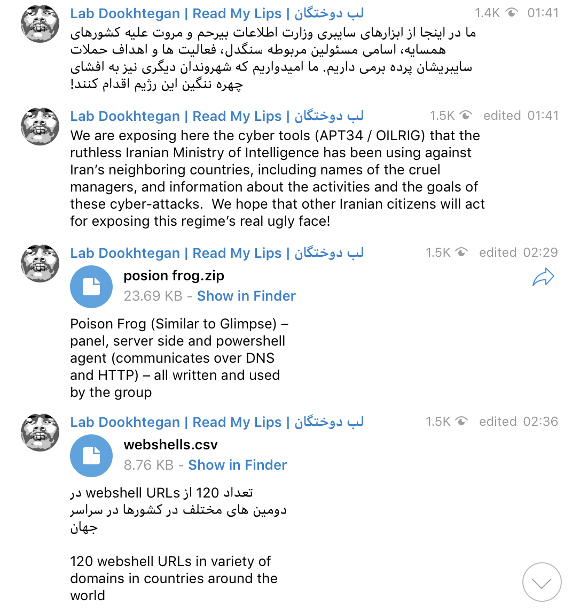

# APT34/OILRIG Leak

Few weeks ago a group of Iranian hackers called "Lab Dookhtegan" started leaking information about the operations of APT34/OILRIG(Iranian Ministry of Intelligence Hackers) which supposedly would be the Iranian Ministry of Intelligence. The leaks started on March 26 when Dookhtegan started dropping archive containing source code on Telegram. The initial leak has recieved low coverrage so far and the Telegram group where the leak first appeard only has about 30 members. It is unclear who the leaker(s) is/are.

This article is a quick overview of the leak and will contain some IOC.

## IOC

### Tools

* [Glimpse](Tools/Glimpse)

  Panel, server side and powershell agent (communicates over DNS) – all written and used by the group.
  
* [Poison Frog (Similar to Glimpse)](Tools/PosionFrog)

  Panel, server side and powershell agent (communicates over DNS and HTTP) – all written and used by the group.

* [Webmask](Tools/Webmask) - DNSpionage tool.

  Code used for MITM to extract authentication details (written in python) and code for managing the DNS hijacking.

* [Webshells_and_Panel](Tools/Webshells_and_Panel)

  Highshell, Hypershell, Minion Project, FoxPanel – webshell codes and their managing panels created and used by the group.

### WebShells

* [Abu Dhabi Statistics Center scad.ae](WebShells/Abu\ Dhabi\ Statistics\ Center\ scad.ae)

  Passwords for admins and IT users in [scad.ae](scad.ae) (Statistics Center - Abu Dhabi).

* [Abu Dhabi airports](WebShells/Abu\ Dhabi\ airports)

  Webshell url
over 900 usernames and passwords in [adac.ae](adac.ae) (abu dhabi airport), and webshell url.

* [Dubai Media Inc](WebShells/Dubai\ Media\ Inc)
  
  Over 250 usernames and passwords in [dmi.ae](dmi.ae) (Dubai Media Inc.)

* [Emirates Federal Competitiveness and Statistics Authority](WebShells/Emirates\ Federal\ Competitiveness\ and\ Statistics\ Authority)

  Passwords for users in [fcsa.gov.ae](fcsa.gov.ae) (Federal Competitiveness and Statistics Authority).

* [Emirates Ministry of Presidental Affairs](WebShells/Emirates\ Ministry\ of\ Presidental\ Affairs)

  Over 900 usernames and passwords in [mopa.ae](mopa.ae) (Ministry of Presidential Affairs), and over 80 users and passwords for webmail.

* [Emirates NMC National Media Company](WebShells/Emirates\ NMC\ National\ Media\ Company)

  Mimikatz outputs of computers in NMC (National Media Company), and webshell path.

* [Emirates National Oil Co](WebShells/Emirates\ National\ Oil\ Co)

  Webshell URLs in [enoc.com](enoc.com), with passwords, webshell type and more webshell info.

* [Emirates National Oil Co 2](WebShells/Emirates\ National\ Oil\ Co\ 2)

  Several mimikatz outputs of computers in [enoc.com](enoc.com) (Emirates National Oil Co.), over 60 usernames and passwords for webmail of [enoc.com](enoc.com).

* [Emirates Policy Center](WebShells/Emirates\ Policy\ Center)

  Passwords for admins and system users in [epc.ae](epc.ae) (Emirates Policy Center).

* [Emirates Prime Minister Office](WebShells/Emirates\ Prime\ Minister\ Office)

  Usernames and passwords in [pmo.gov.ae](pmo.gov.ae).

* [Etithad Airways](WebShells/Etithad\ Airways)

  Over 10000 usernames and passwords in [etihad.ae](etihad.ae) (Etihad Airways), one username with password to etihad.ae webmail.

* [Jordan NITC - National Information Technology Center](WebShells/Jordan\ NITC\ -\ National\ Information\ Technology\ Center)

  File from [nitc.gov.jo](nitc.gov.jo) network with server info, users, passwords, URLs, IPs and more.

* [Jordan Software solutions company primus.com.jo](WebShells/Jordan\ Software\ solutions\ company\ primus.com.jo)

  Webshell URL in primus.com.jo with key for the webshell, and webshell code.

* [Kuwait Amiri Diwan da.gov.kw](WebShells/Kuwait\ Amiri\ Diwan\ da.gov.kw)

  Mimikatz outputs of computers in [da.gov.kw](da.gov.kw), and webshell URL.

* [Lamprell Energy Ltd](WebShells/Lamprell\ Energy\ Ltd)

  2 webshell URLs in [lamprell.com](lamprell.com).

* [National Securtiy Agency of Bahrain](WebShells/National\ Securtiy\ Agency\ of\ Bahrain)

  Over 30 usernames and passwords in [nsa.gov.bh](nsa.gov.bh) (National Security Agency of Bahrain).

* [Nigerian building and road research institute](WebShells/Nigerian\ building\ and\ road\ research\ institute)

  Output of sql injection on [nbrri.gov.ng](nbrri.gov.ng) with info from the DB - usernames, passwords and more.

* [Oman Administrative court admincourt.gov.om](WebShells/Oman\ Administrative\ court\ admincourt.gov.om)

  Webshell URL in [admincourt.gov.om](admincourt.gov.om) with key for the webshell.

* [Qatar padiwan.gov.qa](WebShells/Qatar\ padiwan.gov.qa)

  Over 20 usernames and passwords for [padiwan.gov.qa](padiwan.gov.qa) webmail.

* [Qatar padiwan.gov.qa 2](WebShells/Qatar\ padiwan.gov.qa\ 2)

  Over 20 usernames and passwords for [padiwan.gov.qa](padiwan.gov.qa) webmail.

* [base.aspx.txt](WebShells/base.aspx.txt)

  Webshell written by the group, uses encrypted RSA communication.

* [cdhq.gov.ae](WebShells/cdhq.gov.ae)

  Access file created by the hackers - server IPs, several users and passwords and more.

* [sstc.com.sa](WebShells/sstc.com.sa)

  Webshell URL in [sstc.com.sa](sstc.com.sa) with key for the webshell.

* [webshells.csv](WebShells/webshells.csv)

  120 webshell URLs in variety of domains in countries around the world.

### IPs

* 185.56.91.61
* 46.165.246.196
* 185.236.76.80
* 185.236.77.17
* 185.181.8.252
* 185.191.228.103
* 70.36.107.34
* 109.236.85.129
* 185.15.247.140
* 185.181.8.158
* 178.32.127.230
* 146.112.61.108
* 23.106.215.76
* 185.20.187.8
* 95.168.176.172
* 173.234.153.194
* 173.234.153.201
* 172.241.140.238
* 23.19.226.69
* 185.161.211.86
* 185.174.100.56
* 194.9.177.15
* 185.140.249.63
* 81.17.56.249
* 213.227.140.32
* 46.105.251.42
* 185.140.249.157
* 198.143.182.22
* 213.202.217.9
* 158.69.57.62
* 168.187.92.92
* 38.132.124.153
* 176.9.164.215
* 88.99.246.174
* 190.2.142.59
* 103.102.44.181
* 217.182.217.122
* 46.4.69.52
* 185.227.108.35
* 172.81.134.226
* 103.102.45.14
* 95.168.176.173
* 142.234.200.99
* 194.9.179.23
* 194.9.178.10
* 185.174.102.14
* 185.236.76.35
* 185.236.77.75
* 185.161.209.157
* 185.236.76.59
* 185.236.78.217
* 23.227.201.6
* 185.236.78.63

## License

This project is licensed under the MIT License - see the [LICENSE](LICENSE.md) file for details.
